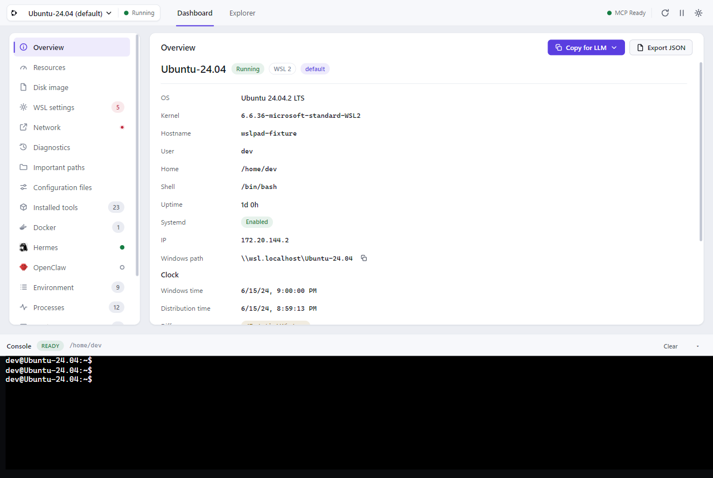
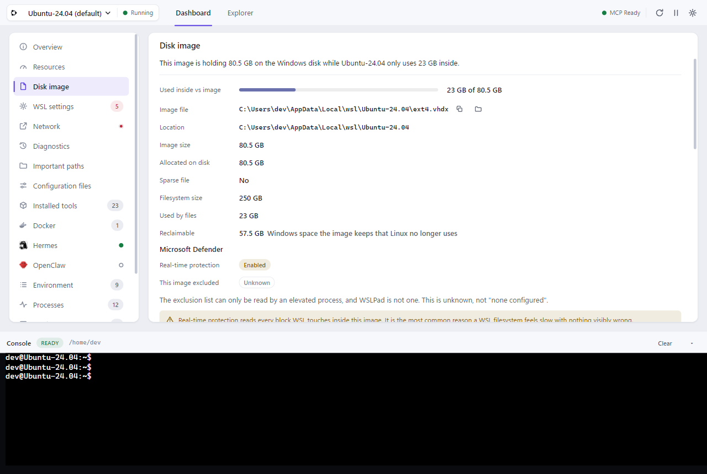
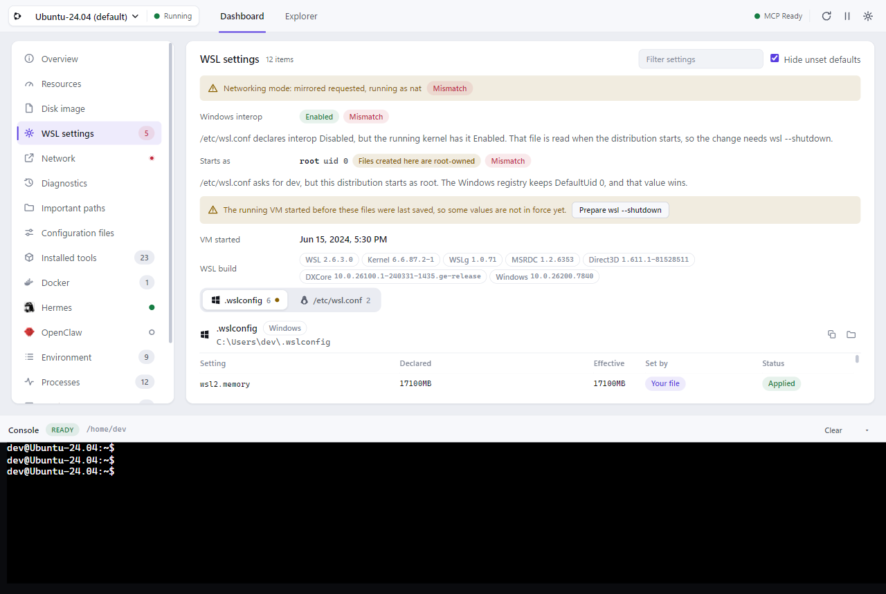
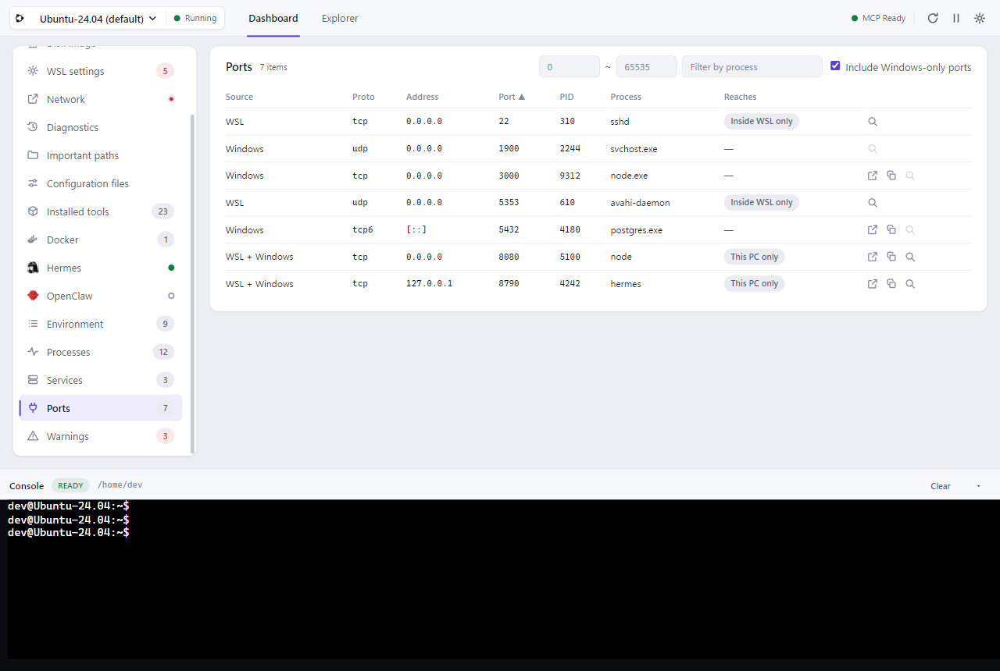
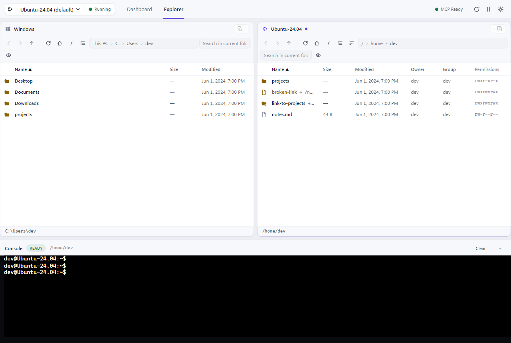
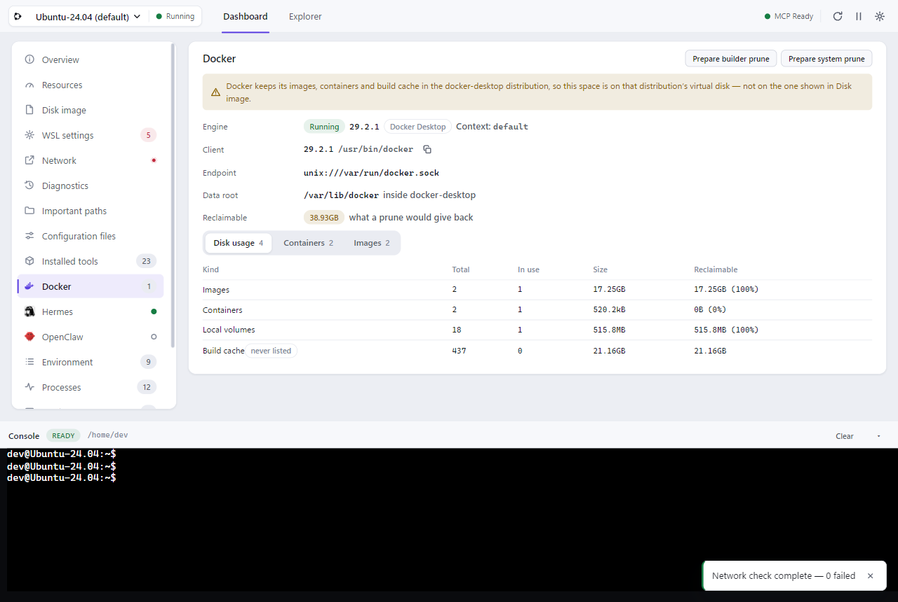
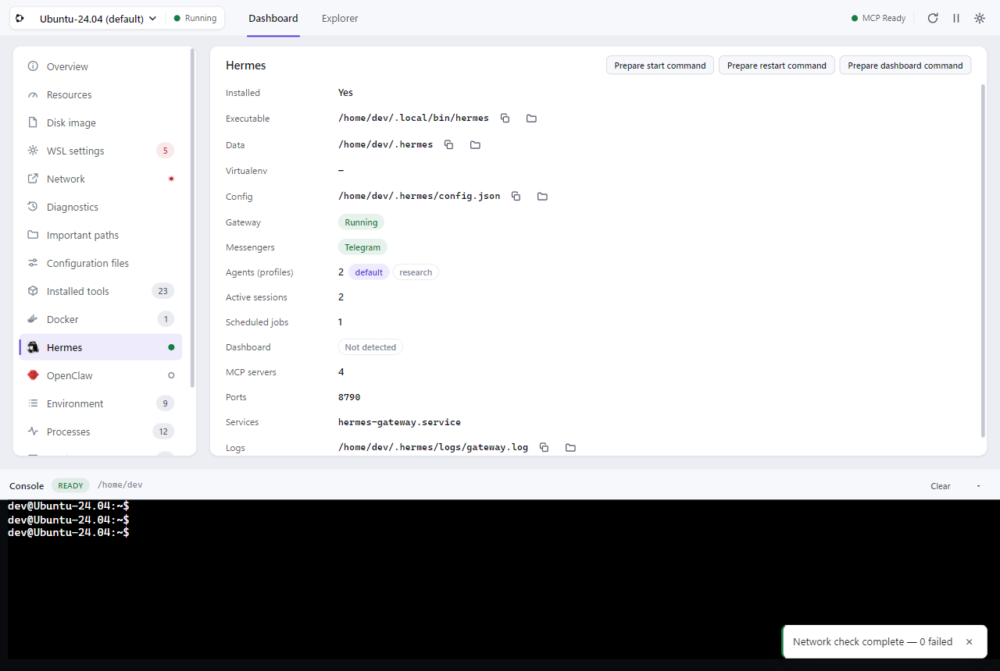

# WSLPad

[English](README.md) · [한국어](README.ko.md) · [日本語](README.ja.md) · [简体中文](README.zh-CN.md) · [繁體中文](README.zh-TW.md) · [Español](README.es.md) · [Français](README.fr.md) · **Deutsch** · [Português (Brasil)](README.pt-BR.md)

[](https://github.com/r2cuerdame/WSLPad/releases/latest)
[](https://github.com/r2cuerdame/WSLPad/releases)
[](https://github.com/r2cuerdame/WSLPad/discussions)
[](LICENSE)
[](https://github.com/sponsors/r2cuerdame)

> Ein kleiner Windows-Begleiter für WSL.

WSLPad ist eine Windows-Tray-App, die dauerhaft im Hintergrund läuft und die
unsichtbaren Teile Ihrer WSL-Umgebung sichtbar macht: welche Distributionen
laufen, wo Ihre Tools liegen, was auf welchem Port lauscht — dazu ein echter
Datei-Explorer, eine interaktive Console und ein **MCP-Server mit
Nur-Lese-Zugriff**, damit Ihre LLM-Tools Ihre Umgebung inspizieren (und
niemals verändern) können.



## Warum

Installieren Sie Hermes, Codex, Claude, Docker, Node oder Python in WSL, und
plötzlich ist von Windows aus nichts mehr sichtbar: Installationspfade,
Konfigurationsdateien, Umgebungsvariablen, Dienste, Ports, der systemd-Status
oder wie Linux-Pfade auf Windows-Pfade abgebildet werden. WSLPad bringt all das
in ein Dashboard, einen Explorer und eine MCP-Oberfläche — ohne jemals hinter
Ihrem Rücken etwas an Ihrem System zu ändern.

## Die drei Oberflächen

### Dashboard — Zustand nur lesend, Bereich für Bereich

Links einen Bereich wählen, rechts lesen — sechzehn davon, von der Übersicht
bis zu den Warnungen. Tabellen bekommen das ganze Fenster statt einer beengten
Karte, und die Liste trägt Live-Badges. Die vollständige Aufstellung steht
[weiter unten](#was-sie-wirklich-sehen); vier Bereiche verdienen eine eigene
Erwähnung, weil sie Fragen beantworten, die WSL selbst offenlässt:

**Datenträgerabbild** — die `ext4.vhdx` Ihrer Distribution wächst und schrumpft
nie wieder, und `df` innerhalb von Linux meldet ein fiktives Maximum. WSLPad
zeigt, wo das Abbild wirklich liegt, was es auf Ihrem Windows-Datenträger
belegt, was die Distribution darin tatsächlich nutzt und wie viel davon
rückgewinnbar ist.



**WSL-Einstellungen** — WSL nimmt eine Konfiguration entgegen und ignoriert
stillschweigend die Hälfte davon. Jeder Schlüssel aus `.wslconfig` und
`wsl.conf` wird mit seinem deklarierten Wert, dem tatsächlich wirksamen Wert
und einem Urteil angezeigt: übernommen, Neustart nötig, falscher Abschnitt,
unbekannter Schlüssel oder auf diesem Build nicht unterstützt. Einschließlich
des Netzwerkmodus, den Sie angefordert haben, gegenüber dem, den Sie bekommen
haben. Die beiden Dateien liegen auf zwei verschiedenen Maschinen und werden an zwei verschiedenen Stellen bearbeitet, also liest man sie einzeln — der Umschalter zeigt, wie viele Schlüssel jede Datei deklariert, und markiert die, die Aufmerksamkeit braucht.



**Netzwerk** — die Hyper-V-Firewall, die das Fenster der Windows-Firewall nie
zeigt, die standardmäßig aktiv ist und eingehenden Datenverkehr zu WSL
stillschweigend verwirft, dazu ein Block zur Namensauflösung, der
`/etc/resolv.conf`, `generateResolvConf`, DNS-Tunneling und die Server des
Windows-Adapters nebeneinanderstellt — damit „Temporary failure in name
resolution“ eine einzige Stelle zum Nachsehen hat.

**Ports** — ein WSL-Listener wird mit `WSL` markiert, oder mit `WSL + Windows`,
wenn er von Windows aus tatsächlich erreichbar ist, und jeder trägt jetzt ein
**Erreichbarkeitsurteil**: reicht ins Netzwerk, nur bis zu diesem PC, nur
innerhalb von WSL oder nirgendwohin — samt Begründung, hergeleitet aus der
Bind-Adresse, dem wirksamen Netzwerkmodus und der Firewall. Wenn die Fakten
nicht lesbar sind, sagt WSLPad *unbekannt*, statt zu raten. Auf einer beschäftigten Maschine lauschen Hunderte von Ports, deshalb gibt es einen Portbereich und einen Prozessnamen-Filter — „wer hält 5173" ist eine Frage und keine Scroll-Übung.



Das Dashboard führt nie etwas aus. Schaltflächen wie *kill*, *Dienst neu
starten* oder *sudoedit* **bereiten** den Befehl lediglich in der Eingabezeile
der Console (Konsole) vor — Sie prüfen, bearbeiten und drücken Enter.



### Explorer — Windows links, WSL rechts

Ein echter Dateimanager mit zwei Bereichen: links Ihre **Windows**-Laufwerke,
rechts die ausgewählte **WSL-Distribution**, dazwischen ein verschiebbarer
Trenner. Das Kopieren zwischen beiden ist der eigentliche Zweck — ziehen Sie
Dateien hinüber oder klicken Sie auf *In den anderen Bereich kopieren* — und
jede Übertragung meldet ihren Fortschritt und lässt sich abbrechen. Eine
Übertragung löscht niemals ihre Quelle.

Jeder Bereich hat seinen eigenen Verlauf, Breadcrumb, seine Pfadleiste, Suche,
einen optionalen, nachladenden Ordnerbaum, eine sortierbare Liste, Neue Datei/
Neuer Ordner, Umbenennen direkt in der Liste (F2), Kopieren/Ausschneiden/
Einfügen sowie Entf → Papierkorb, mit Umschalt+Entf zum endgültigen Löschen.
Der WSL-Bereich zeigt zusätzlich Besitzer/Gruppe/Linux-Berechtigungen und
Linkziele und bietet die vier Varianten zum Kopieren des Pfads; privilegierte
Operationen werden nicht mit sudo vorgetäuscht — stattdessen wird der passende
Befehl in der Console vorbereitet. Ein Doppelklick auf eine Textdatei öffnet
auf beiden Seiten den eingebauten Editor als Overlay (Zeilennummern, Suchen,
Strg+S, JSON formatieren).

### Console — eine echte Shell, immer griffbereit

Eine echte interaktive PTY-Sitzung pro Distribution (bash/zsh, Farben, Strg+C,
Tab-Vervollständigung, vim/htop/ssh funktionieren alle), angedockt am unteren
Rand jedes Tabs. Ein Rechtsklick fügt ein — oder kopiert die Auswahl, wenn es
eine gibt —, genau so, wie sich jedes andere Terminal auch verhält. Wenn Sie im
WSL-Bereich des Explorers navigieren, folgt die Console in dasselbe
Verzeichnis — ohne sichtbares `cd`, ohne Ihren Shell-Verlauf zuzumüllen. Nur
Befehle, die **Sie** ausführen, erscheinen im Mitschnitt; die internen Abfragen
von WSLPad laufen über einen separaten, verborgenen Runner.

Sie erholt sich außerdem von selbst. WSL ist oft noch beschäftigt, wenn WSLPad mit Windows startet, und eine Shell, die nicht gestartet werden konnte, wird jetzt genau so gemeldet — **mit dem Grund** — statt als irreführendes „Distribution gestoppt". Sobald die Distribution als laufend gilt, versucht es die Konsole ungefragt erneut, und wenn es weiterhin nicht klappt, bleibt eine Schaltfläche zum erneuten Verbinden stehen. Die App neu zu starten ist nie die Antwort.

## MCP-Server (nur lesend)

Solange WSLPad im Tray sitzt, stellt es MCP unter `http://127.0.0.1:4923/mcp`
bereit (Streamable HTTP, nur localhost, Authentifizierung per Bearer-Token) mit
40 `Get*`-Tools — `GetDashboardSnapshot`, `GetInstalledTools`, `GetPorts`,
`GetTextFile`, `GetPortOwner`, `GetCommandResolution`, … Tools zum Schreiben, Ausführen oder Beenden
gibt es bewusst nicht; Secrets und private Schlüssel überschreiten die
MCP-Grenze nie. Registrierung per Klick für Claude Desktop (stdio-Bridge),
Codex und Hermes, dazu `Für LLM kopieren`, das eine maskierte
Markdown-Zusammenfassung des Zustands in Ihre Zwischenablage legt.
Details: [docs/MCP.md](docs/MCP.md).

## Was Sie wirklich sehen

Jeder Punkt unten wird von Ihrem Rechner gelesen und unverändert angezeigt.
Nichts davon ändert etwas; wo es eine Aktion gibt, wird sie in die Console
geschrieben, damit Sie sie ausführen.

**Übersicht** — Name der Distribution, Status, WSL-Version, Kennzeichnung als
Standard, Anzeigename des Betriebssystems, Kernel, Hostname, Benutzer,
`$HOME`, Login-Shell, Laufzeit, ob systemd aktiv ist, die IP der Distribution,
der `\\wsl.localhost\…`-Pfad für Windows und die Abweichung der Uhr zwischen
Windows und der Distribution — die unsichtbare Ursache plötzlicher apt- und
TLS-Fehler, nachdem der Host im Ruhezustand war.
Und ob die Distribution überhaupt noch antwortet: `wsl --list` meldet
stundenlang weiter Running, nachdem eine Distribution aufgehört hat zu
reagieren. Bekommt die Sonde nichts zurück, sagt das Abzeichen **Läuft —
antwortet nicht** und nennt die letzte Antwort — ab da ist jeder Wert hier der
letzte gute, kein frischer.

**Ressourcen** — CPU-Auslastung in Echtzeit, belegter/gesamter
Arbeitsspeicher, Swap, Datenträgernutzung für `/`, `/home` und `/mnt/c`,
Durchschnittslast, Anzahl der Prozesse und Verlaufs-Sparklines, damit eine Zahl
die Frage „steigt das gerade?“ beantwortet. Dazu der **Speicherabgleich**:
Windows-Arbeitsspeicher, das WSL-Speicherlimit (und ob Sie es gesetzt haben
oder WSL es berechnet hat), wie viel Windows gerade für die VM hält, und die
Aufteilung in Linux nach belegt / Cache / frei / Swap — damit sich „vmmem
frisst 7 GB“ in „das meiste davon ist rückgewinnbarer Seitencache“ auflöst.

**Datenträgerabbild** — wo die `ext4.vhdx` auf Ihrem Windows-Datenträger
tatsächlich liegt, ihre logische Größe, wie viel davon wirklich belegt ist, ob
sie eine Sparse-Datei ist, Größe und Belegung des Dateisystems innerhalb der
Distribution und wie viel rückgewinnbar ist.

**WSL-Einstellungen** — zuerst der WSL-Build, der Kernel, WSLg, MSRDC,
Direct3D, DXCore und die Windows-Version aus `wsl --version`, denn jedes Urteil
„auf diesem Build nicht unterstützt" ist eine Aussage über genau diese Zahlen.
Danach jeder Schlüssel aus `.wslconfig` und `/etc/wsl.conf`
mit seinem deklarierten Wert, dem tatsächlich wirksamen Wert, seiner Herkunft
(von Ihnen gesetzt, WSL-Standard oder aus Ihrer Hardware berechnet) und einem
Urteil: übernommen, Neustart nötig, nicht gesetzt, unbekannter Schlüssel
(Tippfehler), falscher Abschnitt oder auf diesem Build nicht unterstützt.
Einschließlich des tatsächlich laufenden Netzwerkmodus gegenüber dem
angeforderten und eines Banners, wenn die VM älter ist als Ihre letzte
Änderung.
Dann zwei Antworten, die WSL auf zwei Maschinen verteilt: ob der Kernel
wirklich die Interop-Registrierung hat, die `[interop] enabled=` verlangt hat —
diese Datei wird einmal beim Start der Distribution gelesen, eine spätere
Änderung bewirkt bis `wsl --shutdown` nichts — und als welcher Benutzer sich
die Distribution anmeldet, wo `DefaultUid` in der Windows-Registry `[user] default=`
in `/etc/wsl.conf` stillschweigend schlägt.

**Wichtige Pfade** — `$HOME`, `/etc`, `/usr/local/bin`, `~/.local/bin`,
`~/.config`, `~/.cache`, `~/.ssh`, `~/.hermes`, das Windows-Benutzerprofil aus
Linux-Sicht — jeweils mit der Angabe, ob es existiert, in Linux- wie in
Windows-Schreibweise und auf welcher Seite der Grenze zum Windows-Dateisystem
es liegt (nativ auf ext4 oder jenseits der langsamen Windows-Einbindung).
Und wie die Windows-Laufwerke darunter wirklich eingehängt sind. Fast die ganze
Überraschung steckt in einer Option: ohne `metadata` melden `chmod` und `chown`
unter `/mnt/c` Erfolg und speichern nichts — der Modus wird bei jedem Lesen aus
der umask neu gebildet, die Änderung ist also vor dem nächsten `ls` wieder weg.
Skripte bleiben nicht ausführbar, und nirgends erscheint ein Fehler.

**Konfigurationsdateien** — `.wslconfig`, `/etc/wsl.conf`, `/etc/fstab`,
`~/.bashrc`, `~/.profile`, `~/.zshrc`, `~/.config`, `/etc/environment`: wo
jede Datei liegt und ob sie existiert, lesbar und beschreibbar ist.

**Installierte Tools** — 86 Tools in 11 Kategorien (KI-CLIs,
Laufzeitumgebungen, Paketmanager, Versionsverwaltung, Container, Cloud,
Build-Tools, Datenbanken, Editoren und Shells, Medien, Dienstprogramme),
jeweils mit Installationsstatus, aufgelöstem Pfad, Version, Installationsart,
Konfigurationspfaden, Anzahl laufender Prozesse, auf welcher Seite der Grenze
zum Windows-Dateisystem es liegt und — wichtig — ob der Befehl tatsächlich auf
ein **Windows**-Programm unter `/mnt/c` auflöst statt auf eines, das in der
Distribution installiert ist.

**Docker** — ein eigener Abschnitt: Engine- und Client-Version, Kontext,
Datenverzeichnis, Images und Container sowie die Aufschlüsselung von
`docker system df` — einschließlich des **Build-Cache**, den keine Liste zeigt
und der regelmäßig das Größte auf der Maschine ist. Unter Docker Desktop nennt
er außerdem die Distribution, auf deren virtueller Festplatte dieser Platz
wirklich liegt, denn es ist nicht die betrachtete. Nur lesend: nichts wird
geholt, gestartet, gestoppt oder bereinigt — die Prune-Befehle werden in der
Konsole vorbereitet.



**Hermes** — Programmdatei, Datenverzeichnis, virtuelle Umgebung, Konfiguration, Status des Gateways, **mit welchen Messengern es tatsächlich verbunden ist**, die Profile, die man Agenten nennen würde (das aktuelle markiert), aktive Sitzungen, geplante Aufgaben, Status und Adresse des Dashboards, Anzahl der MCP-Server, Ports, Benutzerdienste und Pfade der Protokolle. Messenger und Profile stammen aus Hermes' eigener, nur lesender CLI; lässt sie sich nicht befragen, steht dort *unbekannt* und nicht „nichts konfiguriert". Das Web-Dashboard läuft nicht? Der Befehl zum Starten wird in der Konsole vorbereitet.

**OpenClaw** — ein eigener Abschnitt neben Hermes: Programmdatei,
Datenverzeichnis, Version, Installationsweg, auf welcher Seite der
Dateisystemgrenze es liegt und ob es läuft. Erkannt im selben Katalogdurchlauf
wie jedes andere Werkzeug — WSLPad startet OpenClaw nie, um es zu befragen.



**Umgebungsvariablen** — jede Variable mit ihrer Länge und ihren Merkmalen
(PATH-artig, von Windows übernommen). Namen, die nach einem Secret aussehen,
werden maskiert; das Anzeigen ist ein bewusster Klick.

**Prozesse** — PID, Benutzer, CPU %, RAM %, verstrichene Zeit, vollständige
Befehlszeile.

**Dienste** — jede systemd-Unit mit Bereich, Load-/Active-/Sub-Status,
Aktivierungszustand und Beschreibung — und für rund 71 bekannte Units eine
Erklärung in normaler Sprache, was sie ist und ob sie normalerweise läuft.

**Ports** — Protokoll, Adresse, Port, PID, Prozess, Lauschstatus, die Quelle
(`WSL`, `Windows`, `WSL + Windows`) und ein Erreichbarkeitsurteil samt
Begründung: reicht ins Netzwerk, nur bis zu diesem PC, nur innerhalb von WSL,
nirgendwohin oder unbekannt. Filtern nach Portbereich und Prozessname — die Namenssuche sieht sowohl den WSL-Prozess als auch den Windows-Prozess an, der denselben Port hält.

**Netzwerk** — der Zustand der Hyper-V-Firewall für die virtuelle WSL-Maschine
(aktiviert, Standardaktion für eingehenden und ausgehenden Datenverkehr,
Loopback-Ausnahme, Anzahl der Regeln) und die Namensauflösung: ob
`/etc/resolv.conf` der erzeugte Symlink oder von Hand bearbeitet ist, das
wirksame `generateResolvConf`, DNS-Tunneling, die verwendeten Nameserver und
das, was der Windows-Adapter verteilt. Dazu die **Portweiterleitungs**-Regeln von Windows: Unter NAT bekommt die Distribution bei jedem WSL-Neustart eine neue Adresse, sodass eine einmal angelegte `netsh portproxy`-Regel unbemerkt ins Leere weiterleitet. WSLPad stellt jede Regel neben die aktuelle Adresse und sagt, welche tot sind.

**Warnungen** — gestoppte Distribution, systemd aus, wenig Speicherplatz,
fehlgeschlagene Units, Portkonflikte, fehlgeschlagene Hintergrundabfragen,
MCP-Probleme.

**Explorer** — pro Datei: Name, Größe, Änderungszeit und auf der WSL-Seite
Besitzer, Gruppe, Linux-Berechtigungen und Linkziele. Pro Laufwerk auf der
Windows-Seite: freier und gesamter Speicherplatz.

**Console** — die Distribution, das aktuelle Verzeichnis und der Zustand der Shell (bereit, wird ausgeführt, wartet auf Eingabe, wartet auf ein sudo-Passwort, getrennt, Distribution gestoppt oder Start fehlgeschlagen — Letzteres mit dem Grund).

**Windows-Downloadmarkierungen** — jede aus Windows kopierte Datei hinterlässt
daneben eine `:Zone.Identifier`-Datei, für immer. WSLPad zählt sie, nennt die
Ordner, in denen sie liegen, und bereitet den Aufräumbefehl vor.

**Windows Terminal** — ob diese Distribution überhaupt ein Profil hat, ob es
ausgeblendet ist, und das JSON zum Hinzufügen, wenn keines da ist. WSLPad
schreibt settings.json nie.

**Papierkorb** — was der Explorer dorthin geschickt hat, woher jede Datei kam,
und ein Wiederherstellen, das sie zurücklegt. Liegt am Ziel schon etwas, bricht
es ab: ein Rückgängig, das eine Datei zerstört, ist kein Rückgängig.


**Wo der Platz geblieben ist** — der Disk-Abschnitt benennt, was die Lücke
zwischen Imagegröße und tatsächlicher Nutzung füllt: Paket-Caches, das
systemd-Journal, Build-Caches, der Papierkorb, Dockers Speicher, jeweils mit dem
Befehl, der ihn leeren würde. Auf dem Rechner, auf dem das entstand: 1,2 GB, von
denen niemand wusste.

**Dienstprotokolle, an Ort und Stelle** — die letzten Zeilen eines Unit-Journals,
ohne eine Shell zu öffnen. ISO-Zeitstempel, und es unterscheidet ein leeres
Journal von einem, das dieser Benutzer nicht lesen darf.

**Langsame Pfade, dort benannt, wo sie kosten** — eine Konsole unter `/mnt` wird
markiert. Jede Datei, die ein Build dort anfasst, überquert die Windows-Grenze:
der häufigste Grund für "WSL ist langsam", und die Eingabeaufforderung sieht
exakt gleich aus.


**Über MCP** — alles davon über 40 `Get*`-Tools mit Nur-Lese-Zugriff.
[docs/MCP.md](docs/MCP.md)

## Settings & Sprachen

Das Zahnrad (oben rechts, immer verfügbar) öffnet eine Settings-Leiste
(Einstellungen) — nie einen dritten Tab: Sprache, Design (System/Hell/Dunkel),
Mit Windows starten, Überwachung anhalten + schnelle/mittlere/langsame
Abfrageintervalle, Explorer-Standardwerte, Schriftart/Scrollback der Console,
Updateprüfung — mit sichtbarem Zustand: Prüfung läuft, verfügbar, Download-Fortschritt, installationsbereit (mit Neustart-Schaltfläche) oder warum es fehlschlug —, alles zurücksetzen — und das vollständige **MCP-Panel**: Status,
Endpunkt kopieren, Konfigurations-JSON kopieren, Registrierung per Klick für
Codex / Claude Desktop / Hermes, Verbindungstest und Token-Neugenerierung.

WSLPad bringt vollständige UI-Übersetzungen für **9 Sprachen** mit — 한국어,
English, 日本語, 简体中文, 繁體中文, Español, Français, Deutsch, Português do
Brasil — mit automatischer Erkennung der Windows-Sprache und Rückfall auf
Englisch. Linux-Befehle, Pfade und technische Bezeichnungen werden nie
übersetzt; die Sprachpakete liegen offline bei, mit erzwungener
Schlüsselgleichheit.

## Installation

Laden Sie `WSLPad-Setup-<version>.exe` von den
[Releases](https://github.com/r2cuerdame/WSLPad/releases) herunter und führen
Sie die Datei aus — Administratorrechte sind nicht nötig (Installation pro
Benutzer). WSLPad startet standardmäßig mit Windows (umschaltbar im Tray oder
in den Settings), lebt im Tray und aktualisiert sich automatisch über GitHub
Releases. Das Schließen des Fensters blendet es nur aus; *Beenden* im Tray-Menü
beendet die App. Das **Über**-Untermenü im Tray führt die laufende Version, das
GitHub-Repository, die Versionshinweise und die Sponsoring-Seite. Eine im Tray
gestartete Updateprüfung wird auch dort beantwortet: Der Menüeintrag wird zum
Zustand (Prüfung läuft, verfügbar, Download-Fortschritt, installationsbereit),
und das Ergebnis kommt als Desktop-Benachrichtigung — das Fenster drängt sich
nie in den Vordergrund.

> Der Installer ist nicht signiert — SmartScreen fragt einmal nach („Weitere
> Informationen“ → „Trotzdem ausführen“).

Voraussetzungen: Windows 10/11 x64. WSL ist optional — ohne WSL zeigt WSLPad
einen Einrichtungshinweis, statt abzustürzen.

## Entwicklung

```bash
npm install          # deps (node-pty ships prebuilt N-API binaries)
npm run dev          # electron-vite dev with HMR
npm run typecheck
npm run lint
npm run test         # vitest unit + integration
npm run test:e2e     # Playwright Electron E2E (fixture mode, no WSL needed)
npm run dist         # NSIS installer into release/
```

`WSLPAD_FIXTURE_MODE=1` lässt die komplette App gegen eine deterministische
WSL-Welt im Arbeitsspeicher laufen — genau das nutzen CI und E2E. Siehe
[docs/ARCHITECTURE.md](docs/ARCHITECTURE.md) und
[docs/RELEASING.md](docs/RELEASING.md).

## Datenschutz & Sicherheit

Local-first: keine Cloud, keine Konten, keine Telemetrie. MCP bindet an
localhost, ist per Token abgesichert und schon von der Konstruktion her nur
lesend. Nichts wird ausgeführt, ohne dass Sie Enter drücken. Alle Grundsätze:
[docs/SECURITY.md](docs/SECURITY.md).

## Nicht-Ziele

WSLPad ist *kein* Distributionsmanager und kein Marktplatz, kein Docker
Desktop, keine IDE, keine Git-Oberfläche, kein Debugger, kein LSP, keine
Cloud-Synchronisierung, kein KI-Chat, keine Selbstreparatur. Identität:
**Dashboard + Explorer + Console + MCP nur lesend** — sonst nichts.

## Aktuelle Einschränkungen (v0.7.0)

- Nur Windows x64; der Installer ist nicht signiert (SmartScreen-Warnung)
- Die Zahlen zum Datenträgerabbild brauchen die Windows-Registry und `fsutil`;
  ist eines von beidem nicht lesbar, sagt der Bereich das, statt zu raten
- Der wirksame Netzwerkmodus braucht `wslinfo` (WSL 2.0.4+); ältere Builds
  zeigen ihn als unbekannt
- Die Hyper-V-Firewall-Schicht gibt es nur auf neueren Windows-Builds; wo sie
  fehlt, meldet WSLPad unbekannt statt „deaktiviert“
- Verlaufs-Sparklines liegen nur im Arbeitsspeicher — der Verlauf beginnt neu,
  wenn Sie die App schließen, und das mit Absicht: Ein Tray-Begleiter ist kein
  Monitoring-Agent
- Die cwd-Synchronisierung der Console setzt bash oder zsh als Standard-Shell
  voraus (andere Shells funktionieren, nur eben ohne automatische
  Pfadsynchronisierung)
- Das Kopieren *zwischen* den Bereichen verschiebt nie: Übertragungen über
  Dateisystemgrenzen hinweg sind bewusst reine Kopiervorgänge, damit bei einem
  Fehlschlag nichts gelöscht wird
- Das Hineinziehen aus einem externen Fenster des Windows-Explorers hängt
  davon ab, ob Electron die Dateipfade preisgibt; nutzen Sie stattdessen den
  linken Bereich (oder das Import-Menü)
- Die stdio-Bridge für MCP setzt voraus, dass die Tray-App läuft

## Roadmap

Als Nächstes: vorbereitete Befehle zum Verkleinern und Vergrößern der VHDX, ein
ARM64-Build und ein signierter Installer.

## Community

Fragen, Ideen und „soll das wirklich so aussehen?“ gehören in die
[Discussions](https://github.com/r2cuerdame/WSLPad/discussions) — in jeder der neun Sprachen, die WSLPad spricht.
Fehler gehören in den [Issue-Tracker](https://github.com/r2cuerdame/WSLPad/issues/new/choose), Sicherheitsfragen in ein
[privates Advisory](https://github.com/r2cuerdame/WSLPad/security/advisories/new).

- [Q&A](https://github.com/r2cuerdame/WSLPad/discussions/categories/q-a) — wie geht das, und warum steht da das
- [Ideas](https://github.com/r2cuerdame/WSLPad/discussions/categories/ideas) — was WSLPad als Nächstes zeigen soll; die Auswahlliste für
  0.2 steht schon dort, zusammengestellt aus dem, worüber sich WSL-Nutzer
  stromaufwärts am meisten beschweren
- [Show and tell](https://github.com/r2cuerdame/WSLPad/discussions/categories/show-and-tell) — was es auf deinem Rechner gefunden hat

[CONTRIBUTING](.github/CONTRIBUTING.md) nennt die vier Regeln, die ein Pull Request nicht
brechen darf.

## Lizenz

MIT
