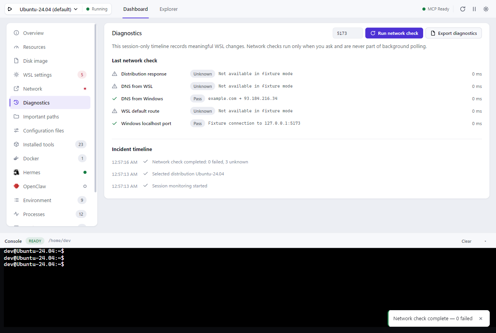

# WSLPad

[English](README.md) · [한국어](README.ko.md) · [日本語](README.ja.md) · **简体中文** · [繁體中文](README.zh-TW.md) · [Español](README.es.md) · [Français](README.fr.md) · [Deutsch](README.de.md) · [Português (Brasil)](README.pt-BR.md)

[](https://github.com/r2cuerdame/WSLPad/releases/latest)
[](https://github.com/r2cuerdame/WSLPad/releases)
[](https://github.com/r2cuerdame/WSLPad/discussions)
[](LICENSE)
[](https://github.com/sponsors/r2cuerdame)

> 为 WSL 打造的小巧 Windows 伴侣。

WSLPad 是一个常驻 Windows 托盘的应用，把 WSL 环境里原本看不见的部分显示出来：
哪些发行版在运行、工具装在哪里、哪个端口上有谁在监听 —— 另外还有一个真正的
双窗格文件管理器、一个可交互的控制台、一个带安全防护的 VHDX 迁移向导，以及
一个**只读 MCP 服务器**，让你的 LLM 工具能够查看（但永远无法修改）你的环境。


## 为什么做它

在 WSL 里装上 Hermes、Codex、Claude、Docker、Node 或 Python 之后，从 Windows
这一侧就什么都看不见了：安装路径、配置文件、环境变量、服务、端口、systemd
状态，还有 Linux 路径和 Windows 路径之间的对应关系。WSLPad 把这些统统整理进
Dashboard（仪表盘）、Explorer（资源管理器）、迁移向导和一个 MCP 接口 —— 而且绝不会背着
你改动系统。

## 核心界面

### Dashboard —— 只读状态，逐个板块查看

在左侧选板块，在右侧看内容：一共十七个，从概览一直到警告。表格能用满整个窗口，
而不是挤在一张小卡片里；左侧列表还带实时角标。完整清单在[下面](#你实际能看到什么)；
其中有五个板块值得单独拿出来说，因为它们回答的正是 WSL 自己不回答的问题：

**磁盘映像** —— 发行版的 `ext4.vhdx` 只会变大，从不自己缩小，而 Linux 里的
`df` 报出来的上限是虚的。WSLPad 会显示这个映像到底在哪里、在你的 Windows 磁盘
上占了多少、发行版内部实际用了多少，以及有多少是可回收的。


**WSL 设置** —— WSL 会收下你的配置，然后悄悄忽略掉其中一半。`.wslconfig` 和
`wsl.conf` 里的每一个键都会列出声明值、实际生效的值，以及一个判定：已生效、
需要重启、写错了小节、未知键，或者当前版本不支持。也包括你要求的网络模式和你
实际拿到的网络模式。 这两个文件位于两台不同的机器上，修改的地方也不同，所以一次只读一个 —— 切换按钮上会显示每个文件声明了多少项，以及哪个文件有需要确认的值。


**网络** —— Windows 防火墙窗口里绝不会显示的 Hyper-V 防火墙，默认开启并默默丢弃进入 WSL 的流量；加上一个把 `/etc/resolv.conf`、`generateResolvConf`、DNS 隧道和 Windows 适配器的服务器并排展示的名称解析块 —— 让 "Temporary failure in name resolution" 有了一个唯一的排查位置。

**端口** —— WSL 侦听器被标记为 `WSL`，或者在 Windows 可以真正访问时标记为 `WSL + Windows`，并且每一个都带有一个**可达性判定**：可从 LAN 访问、仅限此 PC、仅在 WSL 内部可达、不可达 —— 并附有基于绑定地址、有效网络模式和防火墙得出的原因。当事实无法读取时，WSLPad 会显示 *未知* 而不是猜测。繁忙的机器会列出数百个侦听器，因此提供了端口范围和进程名称过滤器 —— “谁占用了 5173” 是一个直接的查询，而不是滚屏苦力。


**诊断与远程恢复** —— 仅限会话的事件时间线连接了睡眠与唤醒、发行版响应能力、DNS 和网络模式更改、Console 恢复以及明确的网络检查。同一检查可识别经过验证的 VS Code Server 进程并展示破坏性最小的恢复阶梯，将 `wsl --shutdown` 保留为最后手段。后台不会探测网络，也不会自动运行恢复命令；诊断导出会先预览隐私敏感字段再保存。



Dashboard 绝不会执行任何操作。*终止*、*重启服务* 或 *sudoedit* 等按钮只会在 Console 输入框中**准备**命令 —— 由你审查、编辑并按下 Enter。

*复制给 LLM* 和 *导出 JSON* 会提取**完整**快照，而不是你正在查看的板块，因此它们位于概览上，而不是每个板块的标题行中。

### Explorer —— 左边 Windows，右边 WSL


一个真正的双窗格文件管理器：左边是你的 **Windows** 驱动器，右边是选中的
**WSL 发行版**，中间是可拖动的分隔条。在两侧之间复制文件正是它存在的意义 ——
直接拖过去，或者点*复制到另一窗格* —— 每次传输都有进度显示，也随时可以取消。
传输永远不会删除源文件。

每个窗格都有各自的历史记录、面包屑、路径栏、搜索、可选的按需加载文件夹树、
可排序列表、新建文件/文件夹、就地重命名（F2）、复制/剪切/粘贴，以及 Delete
移到回收站、Shift+Delete 永久删除。WSL 窗格还会显示所有者/组/Linux 权限和
符号链接目标，并提供四种路径复制方式；需要提权的操作不会偷偷拿 sudo 糊弄过去
—— 而是把对应的命令准备到 Console 里。在任意一侧双击文本文件，就会打开内置的
编辑器浮层（行号、查找、Ctrl+S、JSON 格式化）。

### Console —— 随时在手边的真实 shell

每个发行版一个真正的交互式 PTY 会话（bash/zsh、彩色输出、Ctrl+C、Tab 补全，
vim/htop/ssh 都能正常用），停靠在每个标签页的底部。右键粘贴 —— 有选中内容时
则复制 —— 和其他终端的习惯完全一致。当你在 Explorer 的 WSL 窗格里切换目录时，
Console 会跟着切到同一个目录 —— 不会出现可见的 `cd`，也不会污染你的 shell
历史。会话记录里只有**你**执行的命令；WSLPad 自己的内部查询由另一个隐藏的
执行器完成。

控制台还会自行恢复。WSLPad 随 Windows 启动时 WSL 往往还在忙，无法启动 shell 的状态现在会如实报告 —— **并附上原因** —— 而不是误导性的「发行版已停止」。一旦发行版显示为运行中，控制台会自动重试；若仍然无法启动，重新连接按钮会一直留在那里。重启应用从来不是答案。

### 迁移向导 (Relocation Wizard) —— 安全转移发行版

WSL 导致 C 盘空间告急？分步安全迁移向导会引导你将发行版的 VHDX 虚拟磁盘安全导出并迁移到备用驱动器（例如 D:\），并具备严格的验证关卡。它会检查磁盘空间余量（推荐留出 1.5 倍冗余）、验证备份完整性、保留你的默认 Linux 用户，且绝不会自动执行破坏性命令。

## MCP 服务器（只读）

只要 WSLPad 还在托盘里，它就会在 `http://127.0.0.1:4923/mcp` 上提供 MCP 服务
（Streamable HTTP，仅限本机，Bearer 令牌认证），带 40 个 `Get*` 工具 ——
`GetDashboardSnapshot`、`GetInstalledTools`、`GetPorts`、`GetTextFile`、
`GetPortOwner`, `GetCommandResolution`…… 这里刻意没有任何写入/执行/终止类的工具；密钥和私钥绝不会
越过 MCP 边界。支持一键注册到 Claude Desktop（stdio 桥接）、Codex 和 Hermes，
另外还有 `复制给 LLM`，把脱敏后的 Markdown 状态摘要放进剪贴板。
详见 [docs/MCP.md](docs/MCP.md)。

## 你实际能看到什么

下面每一项都是从你这台机器上读出来、原样显示的。这里没有任何东西会改动系统；
凡是带操作的地方，命令都只会写进 Console，由你自己运行。

**概览** —— 发行版名称、状态、WSL 版本、是否为默认发行版、操作系统显示名、
内核、主机名、用户、`$HOME`、登录 shell、运行时间、systemd 是否开启、发行版
IP、给 Windows 用的 `\\wsl.localhost\…` 路径，以及 Windows 与发行版之间的
时钟差值 —— 主机休眠之后 apt 和 TLS 突然失败的隐形元凶。
还有发行版是否仍在应答：`wsl --list`在发行版停止响应后还会连续几小时说它在运行，
所以当探测拿不到回应时，徽章会变成**正在运行 —
无响应**并写明最后一次应答的时间，
因为从那一刻起这里的每个值都是最后一次的正常值，而不是新值。

**资源** —— 实时 CPU 占用、已用/总内存、交换分区、`/`、`/home` 和 `/mnt/c` 的
磁盘使用量、平均负载、进程数，以及趋势迷你图，好让一个数字能回答“它是在往上
走吗？”。另外还有**内存对账**：Windows 内存、WSL 内存上限（以及它是你设的还是
WSL 自己算出来的）、Windows 当前为这台虚拟机保留了多少，以及 Linux 内部的
已用 / 缓存 / 空闲 / 交换分区分布 —— 于是“vmmem 吃掉了 7 GB”就还原成了“其中
大部分是可以回收的页缓存”。

**磁盘映像** —— `ext4.vhdx` 在你的 Windows 磁盘上究竟在哪里、映像大小、磁盘上
实际分配了多少、是不是稀疏文件、发行版内部的文件系统大小和已用量，以及有多少
可回收。

**WSL 设置** —— 先是 `wsl --version` 报告的 WSL 应用、内核、WSLg、MSRDC、Direct3D、
DXCore 与 Windows 版本，因为下面每一条「此版本不支持」的判定都是关于这些数字的断言。
然后是 `.wslconfig` 和 `/etc/wsl.conf` 里的每一个键，连同声明值、
实际生效的值、由谁设定（你自己写的、WSL 默认值，还是从你的硬件推算出来的），
以及一个判定：已生效、需要重启、默认值、未知键（拼错了）、写错了小节，或者
当前版本不支持。也包括实际运行的网络模式与你要求的网络模式的对比，以及虚拟机
比你最后一次修改还早时给出的提示条。
还有 WSL 分散在两台机器上的两个答案：内核是否真的持有 `[interop] enabled=`
所要求的 interop 注册 —— 该文件只在发行版启动时读取一次，之后的修改在
`wsl --shutdown` 之前不起任何作用 —— 以及这个发行版以哪个用户登录，而 Windows
注册表的 `DefaultUid` 会悄悄压过 `/etc/wsl.conf` 里的 `[user] default=`。

**重要路径** —— `$HOME`、`/etc`、`/usr/local/bin`、`~/.local/bin`、`~/.config`、
`~/.cache`、`~/.ssh`、`~/.hermes`，以及从 Linux 这边看到的 Windows 用户配置
目录 —— 每一项都带存在与否、Linux 和 Windows 两种写法，以及它在文件系统边界的
哪一侧（原生 ext4 的 Linux 磁盘，还是要跨过缓慢的 Windows 驱动器挂载）。
还有它们底下的 Windows 驱动器究竟是怎么挂载的。几乎所有的意外都来自一个选项：
没有 `metadata` 时，在 `/mnt/c` 上执行 `chmod` 和 `chown`
会报告成功但什么都不保存 —— 权限每次读取时都由 umask 重新生成，所以在下一次
`ls` 之前就已经消失了。脚本仍然没有执行权限，而且任何地方都不会打印错误。

**配置文件** —— `.wslconfig`、`/etc/wsl.conf`、`/etc/fstab`、`~/.bashrc`、
`~/.profile`、`~/.zshrc`、`~/.config`、`/etc/environment`：每个文件在哪里，
以及它是否存在、可读、可写。

**已安装工具** —— 11 个类别共 87 个工具（AI CLI、运行时、包管理器、版本控制、
容器、云与远程、构建工具、数据库、编辑器与 Shell、媒体、实用工具），每个都带
安装状态、解析出的路径、版本、安装方式、配置路径、正在运行的进程数、它运行自
文件系统边界的哪一侧，以及 —— 这一点很重要 —— 这个命令实际解析到的是不是
`/mnt/c` 下的 **Windows** 可执行文件，而不是装在发行版里的那一个。

**Docker** —— 独立分区：引擎与客户端版本、上下文、数据根目录、镜像与容器，以及
`docker system df` 的明细 —— 包括任何列表都不显示、却常常是机器上最大的一项的
**构建缓存**。使用 Docker Desktop 时还会指出这些空间实际位于哪个发行版的虚拟磁盘上，
因为那并不是你正在查看的这个。只读：不拉取、不启停、不清理，prune 命令只准备到控制台。


**Hermes** —— 可执行文件、数据目录、虚拟环境、配置、网关状态、**实际连接的是哪些即时通讯平台**、你会称之为智能体的配置档列表（标出当前项）、活动会话、计划任务、仪表板状态与地址、MCP 服务器数量、端口、用户服务和日志路径。即时通讯与配置档的信息来自 Hermes 自己的只读 CLI；无法询问时写的是*未知*，而不是「未配置」。Web 仪表板没运行？启动命令会准备到控制台里。

**OpenClaw** —— 与 Hermes 并列的独立分区：可执行文件、数据目录、版本、安装方式、
位于文件系统边界的哪一侧，以及是否在运行。与其他工具用同一次目录扫描检测，绝不会为了
询问而启动 OpenClaw。


**环境变量** —— 每个变量及其长度和标记（PATH 类、来自 Windows）。看起来像密钥
的变量名会被脱敏；要显示出来，得你主动点一下。

**进程** —— PID、用户、CPU %、内存 %、运行时长、完整命令行。

**服务** —— 每个 systemd 单元的范围、load/active/sub 状态、是否启用和描述 ——
另外对约 71 个常见单元，还有一段大白话说明它是什么、平时是不是在运行。

**端口** —— 协议、地址、端口、PID、进程、监听状态、来源（`WSL`、`Windows`、
`WSL + Windows`），以及一个带理由的可达范围判定：整个网络、仅本机、仅 WSL
内部、哪里都到不了，或者未知。 可按端口范围和进程名筛选 —— 名称搜索会同时查看 WSL 侧进程与占用同一端口的 Windows 进程。

**网络** —— WSL 虚拟机的 Hyper-V 防火墙状态（是否开启、入站和出站默认策略、
WSL 回环例外、提到 WSL 的规则数），以及名称解析：`/etc/resolv.conf` 是 WSL
生成的符号链接还是手工改过的、实际生效的 `generateResolvConf`、DNS 隧道、
正在使用的名称服务器，以及 Windows 适配器下发的服务器。 还有 Windows 的**端口转发**规则：在 NAT 下每次重启 WSL 都会重新分配地址，所以一次添加的 `netsh portproxy` 规则会悄悄转发到空处。WSLPad 把每条规则与发行版当前的地址并排显示，并指出哪些已经失效。

**警告** —— 发行版已停止、systemd 未启用、磁盘空间不足、failed 状态的单元、
端口冲突、后台查询失败、MCP 故障。

**Explorer** —— 每个文件：名称、大小、修改时间，WSL 侧还有所有者、组、Linux
权限和符号链接目标。Windows 侧的每个驱动器：可用空间和总空间。

**Console** —— 当前发行版、当前目录，以及 shell 状态（就绪、运行中、等待输入、等待 sudo 密码、已断开连接、发行版已停止、无法启动 —— 最后一项附带原因）。

**Windows 下载标记文件** —— 每从 Windows 复制一个文件，旁边就会永久留下一个
`:Zone.Identifier` 文件。WSLPad 会数出有多少、分布在哪些目录，并准备好清理命令。

**Windows 终端** —— 这个发行版有没有配置文件、是不是被隐藏了；没有的话给出可直接
粘贴的 JSON。WSLPad 从不写入 settings.json。

**回收站** —— 资源管理器送进回收站的东西、每个文件原本的位置，以及把它放回去的
还原。如果目标位置已经有东西，还原会停下：会毁掉文件的“撤销”不是撤销。

**空间去哪了** —— 磁盘部分会说出镜像大小与 Linux 实际用量之间的差额由什么填满：
软件包缓存、systemd 日志、构建缓存、回收站、Docker 的存储，每一项都带上清理命令。
在开发这个应用的机器上，那是 1.2 GB 谁也不知道的东西。

**服务日志，就地查看** —— 不开 shell 就能看到某个单元日志的最后几行。用 ISO
时间戳，并且能区分「日志是空的」和「你没有权限读」—— 这个区分别的工具都不做。

**慢速路径，在付出代价的地方标出来** —— 控制台位于 `/mnt` 下时会标注。在那里
构建时每碰一个文件都要跨越 Windows 边界，这是「WSL 慢」最常见的原因，而提示符
看起来一模一样。

**通过 MCP** —— 以上全部内容，都可以通过 40 个只读 `Get*` 工具拿到。
[docs/MCP.md](docs/MCP.md)

## Settings（设置）与语言

右上角始终可见的齿轮会打开一个模态设置抽屉（不占用顶层标签页空间）：语言、主题
（跟随系统/浅色/深色）、随 Windows 启动、暂停监控与快速/中速/慢速轮询间隔、
Explorer 默认设置、Console 字体与回滚行数、检查更新（检查中、可用、下载进度、
准备安装并附重启按钮、失败原因都会留在原处显示）、恢复全部默认值 —— 以及
完整的 **MCP 面板**：状态、复制端点、复制配置 JSON、一键注册到 Codex /
Claude Desktop / Hermes、连接测试和重新生成令牌。

WSLPad 内置 **9 种语言**的完整界面翻译 —— 한국어、English、日本語、简体中文、
繁體中文、Español、Français、Deutsch、Português do Brasil —— 会自动检测
Windows 语言，并在缺失时回退到英文。Linux 命令、路径和技术名称一律不翻译；
语言包离线随应用打包，并强制校验键的一致性。

## 安装与 CLI

### 直接下载（推荐）

从 [Releases](https://github.com/r2cuerdame/WSLPad/releases) 下载
`WSLPad-Setup-<version>.exe` 并运行 —— 不需要管理员权限（按用户安装至 `%LOCALAPPDATA%\Programs\WSLPad\`）。

WSLPad 默认随 Windows 启动（登录项带 `--hidden` 参数，可在托盘或 Settings 里切换），
常驻托盘，并通过 GitHub Releases 自动更新。关闭窗口只是把它隐藏到托盘；托盘菜单里的*退出*才会真正结束程序。

> **关于 Windows SmartScreen**：当前版本未签名 —— SmartScreen 在首次运行时会提示一次（“更多信息” → “仍要运行”）。

系统要求：Windows 10/11 x64。WSL 是可选的 —— 没有 WSL 时，WSLPad 会显示一条安装提示，而不是直接崩溃。

### WinGet

官方软件包清单维护在 `packaging/winget/manifests/` 中，并已提交至 Windows Package Manager 社区仓库（PR [microsoft/winget-pkgs#422317](https://github.com/microsoft/winget-pkgs/pull/422317)，等待合并）。

在等待上游合并期间，你可以使用仓库内置的清单进行本地验证和安装：

```powershell
winget install --manifest packaging/winget/manifests/r/r2cuerdame/WSLPad/1.0.1
```

社区仓库 PR 合并后，即可直接使用标准命令安装：

```powershell
winget install r2cuerdame.WSLPad
```

### CLI 参数与后台行为

- `WSLPad.exe` —— 启动应用 GUI（若已有实例在运行，则通过单实例锁激活已有窗口）。
- `WSLPad.exe --hidden` —— 以最小化常驻托盘方式启动（用于 Windows 开机自动启动）。
- `WSLPad.exe --mcp-stdio` —— 用于 Claude Desktop 等本地 MCP 客户端的 stdio 桥接模式。将标准 I/O 代理至后台常驻应用的 HTTP 服务器（`http://127.0.0.1:4923/mcp`）。

## 开发

```bash
npm install          # 或 npm ci（安装依赖）
npm run dev          # electron-vite dev（支持 HMR）
npm run typecheck    # node 和 web 的严格 TypeScript 检查
npm run lint         # ESLint 9
npm run test         # vitest 单元与集成测试（90 个文件，1534 个测试）
npm run build        # electron-vite 生产环境构建
npm run test:e2e     # Playwright Electron E2E（固定模式: WSLPAD_FIXTURE_MODE=1）
npm run dist         # 构建 NSIS 安装程序和 blockmap 到 release/
```

全新 Windows 环境下的发布生命周期冒烟测试（安装、启动、更新检测与应用、卸载、重新安装）：

```powershell
./scripts/release-lifecycle-smoke.ps1 -TargetVersion 1.0.1 -TargetSha256 <SHA256>
```

`WSLPAD_FIXTURE_MODE=1` 会让整个应用跑在一个确定性的内存 WSL 世界上 ——
CI 和 E2E 用的就是它。参见
[docs/ARCHITECTURE.md](docs/ARCHITECTURE.md) 和
[docs/RELEASING.md](docs/RELEASING.md)。

## 隐私与安全

本地优先：没有云端、没有账号、没有遥测。MCP 只绑定到本机并使用令牌认证，从
构造上就是只读的。没有你按下 Enter，任何东西都不会执行。完整原则见
[docs/SECURITY.md](docs/SECURITY.md)。

## 不做的事

WSLPad *不是*发行版管理器或应用市场，不是 Docker Desktop，不是 IDE，没有 Git
界面、调试器或 LSP，没有云同步，没有 AI 聊天，也不会自动帮你修东西。它的身份
就是：**Dashboard + Explorer + Console + 迁移向导 + 只读 MCP** —— 别无其他。

## 当前限制（v1.0.1）

- 仅支持 Windows x64；安装程序未签名（会有 SmartScreen 警告）
- 磁盘映像的数字需要读取 Windows 注册表和 `fsutil`；只要有一样读不到，这个
  板块会如实说明，而不是靠猜
- 实际生效的网络模式需要 `wslinfo`（WSL 2.0.4+）；更老的版本上会显示为未知
- Hyper-V 防火墙这一层只存在于较新的 Windows 版本上；没有这一层的地方，
  WSLPad 会报未知，而不是“已关闭”
- 迁移向导 (Relocation Wizard) 需要目标驱动器具备足够的可用空间（推荐留出 1.5 倍冗余用于临时 tar 导出与 vhdx 导入），并由用户按照引导手动执行 CLI 命令
- 趋势迷你图只存在内存里 —— 关掉应用历史就清零，这是有意为之：托盘伴侣不是
  监控代理
- Console 的工作目录同步需要默认 shell 是 bash 或 zsh（其他 shell 也能用，
  只是没有自动路径同步）
- 两个窗格*之间*只有复制、从不移动：跨文件系统的传输在设计上就只复制，这样
  传输失败时不会有任何东西被删掉
- 从外部的 Windows 资源管理器窗口往里拖，取决于 Electron 是否暴露文件路径；
  请改用左侧窗格（或导入菜单）
- MCP 的 stdio 桥接需要托盘应用处于运行状态

## 路线图

接下来：为控制台准备 VHDX 收缩与扩容命令、ARM64 构建，以及签名的安装程序。

## 社区

提问、想法，以及“这样显示对吗？”这类疑惑，都请到
[Discussions](https://github.com/r2cuerdame/WSLPad/discussions)——用 WSLPad 支持的九种语言中的任意一种都可以。
缺陷请提交到[问题追踪](https://github.com/r2cuerdame/WSLPad/issues/new/choose)，安全问题请通过[私密安全公告](https://github.com/r2cuerdame/WSLPad/security/advisories/new)。

- [Q&A](https://github.com/r2cuerdame/WSLPad/discussions/categories/q-a) — 怎么做，以及为什么这样显示
- [Ideas](https://github.com/r2cuerdame/WSLPad/discussions/categories/ideas) — 接下来该展示什么
- [Show and tell](https://github.com/r2cuerdame/WSLPad/discussions/categories/show-and-tell) — 它在你的机器上发现了什么

[CONTRIBUTING](.github/CONTRIBUTING.md) 列出了拉取请求绝不能破坏的四条规则。

## 许可证

MIT
